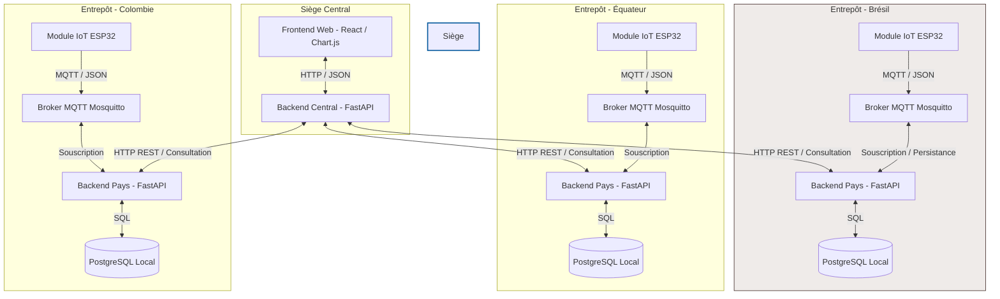

Ce document détaille les choix d'architecture, la pile technologique et les flux de données conçus et implémentés pour le système distribué de suivi de stockage et de surveillance IoT de **FutureKawa**.

---

## 1. Vue d'Ensemble & Topologie Distribuée

Afin de refléter fidèlement l'organisation internationale de FutureKawa (Brésil, Colombie, Équateur, et le siège central), la solution s'appuie sur une **architecture distribuée et décentralisée**.



---

## 2. Choix Technologiques & Justifications

Chaque composant a été sélectionné pour répondre aux contraintes du monde réel (Réseau fluctuant en entrepôt, besoin de robustesse, facilité de maintenance).

### A. FastAPI (Python) - *Backends Pays & Central*
*   **Justification :** FastAPI est un framework web moderne et ultra-performant. 
*   **Critère d'Efficacité :** Basé sur Starlette et Pydantic, il supporte nativement l'asynchronisme (`async/await`), ce qui permet au Backend Central d'interroger les 3 API pays de manière asynchrone et concurrente sans bloquer le thread principal.
*   **Critère de Pérennité :** Génère automatiquement la documentation interactive des API aux normes standards **OpenAPI (Swagger)**, facilitant grandement l'intégration pour les futures équipes de développement.

### B. MQTT via Eclipse Mosquitto - *Messagerie IoT*
*   **Justification :** MQTT est le protocole de messagerie standard pour l'Internet des Objets (IoT).
*   **Critère de Stabilité :** Conçu pour des connexions à bande passante limitée ou instable (cas typique des entrepôts isolés en Amérique du Sud), il consomme très peu d'énergie et de ressources par rapport à du HTTP.
*   **Découpage Temporel :** L'ESP32 publie ses mesures et se déconnecte immédiatement. Le broker stocke le message si l'API locale est momentanément indisponible, garantissant qu'aucune donnée de température critique ne soit perdue.

### C. PostgreSQL - *Persistance Locale*
*   **Justification :** Système de gestion de base de données relationnelle open-source robuste.
*   **Sécurité et Intégrité :** Garantit la conformité ACID complète pour sécuriser l'historique de traçabilité des lots (exigence réglementaire stricte de traçabilité et d'auditabilité pour les clients B2B de FutureKawa).

### D. Docker & Docker Compose - *Conteneurisation*
*   **Justification :** L'ensemble de la solution est conteneurisé.
*   **Portabilité :** Permet un déploiement standardisé et reproductible à l'identique dans chaque pays et au siège, tout en éliminant le problème classique du *"ça marche sur ma machine"*.

---

## 3. Analyse de Robustesse : Stabilité, Efficacité, Pérennité

### 🛡️ Stabilité (Résilience & Autonomie Locale)
La pire erreur architecturale pour FutureKawa aurait été de concevoir une base de données unique au siège avec des appels distants constants depuis les pays : une coupure d'Internet au Brésil bloquerait instantanément l'enregistrement des températures et l'envoi d'alertes locales.

*   **Autarcie Locale :** Chaque pays possède son propre broker MQTT, sa base PostgreSQL locale et son API FastAPI autonome. Si le siège central est en panne ou inaccessible, **l'entrepôt local continue de fonctionner normalement** : les relevés IoT sont enregistrés, et les alertes par email sont émises localement.
*   **Isolation des pannes :** Une panne dans l'entrepôt en Équateur n'affecte en rien les opérations en Colombie ou au Brésil.

### ⚡ Efficacité (Performances Applicatives)
*   **Agrégation Concurrente :** Le backend central n'interroge pas les API pays de manière séquentielle (l'une après l'autre). Il utilise des appels HTTP non-bloquants lancés en parallèle via `asyncio.gather`. Le temps de réponse total équivaut au temps de réponse du pays le plus lent, plutôt qu'à la somme des trois.
*   **Légèreté de l'IoT :** L'envoi de données structurées en JSON léger par MQTT limite la charge réseau locale des microcontrôleurs ESP32.

### 🔄 Pérennité (Évolutivité du système)
*   **Extensibilité sans recodage (Design Patterns d'Infrastructures) :** Le backend central charge la liste des pays de manière dynamique. Pour ajouter un 4ème pays (ex: Costa Rica), il suffit d'ajouter sa variable d'environnement (`COUNTRY_COSTARICA_URL`) au déploiement central.
*   ** découplage total :** Le frontend web ne discute jamais directement avec les pays. Il communique uniquement avec le backend central. Cela permet de modifier l'architecture interne ou de migrer un pays d'un serveur à un autre sans jamais impacter ou réécrire l'interface utilisateur.

---

## 4. Flux de Données Nominaux (Séquences)

### A. Télémétrie et Alerte IoT (Temps Réel Local)
Ce flux montre comment une température hors-limite est captée, enregistrée et comment l'alerte est immédiatement dispatchée localement par email.

```mermaid
sequence_diagram
sequenceDiagram
    participant ESP32 as Module IoT (ESP32)
    participant Broker as Broker Mosquitto Local
    participant API as API Pays Local (FastAPI)
    participant BDD as PostgreSQL Local
    participant SMTP as Serveur SMTP (Email)

    ESP32->>Broker: Publie mesure (JSON: temp, hum) sur "capteur/mesures"
    Note over ESP32, Broker: Protocole MQTT
    Broker-->>API: Transmet le message (Souscription active)
    
    rect rgb(240, 240, 240)
        Note over API: Analyse de la mesure par rapport aux seuils du pays
        alt Température ou Humidité hors-limites
            API->>BDD: Crée une Alerte en BDD (statut: non-lue)
            API->>SMTP: Envoi d'un Email d'Alerte automatique au responsable d'entrepôt
        end
    end

    API->>BDD: Persiste la mesure en BDD (historique traçabilité)
```

### B. Consolidation et Supervision (Siège Central)
Ce flux montre l'asynchronisme utilisé par le siège pour consolider l'état global des stocks en temps réel pour le Directeur des Opérations.

```mermaid
sequence_diagram
sequenceDiagram
    participant User as Navigateur (Directeur)
    participant Central as Backend Central (Siège)
    participant API_BR as API Brésil
    participant API_CO as API Colombie
    participant API_EQ as API Équateur

    User->>Central: GET /api/central/stocks (Consolidation)
    
    Note over Central: Lancement asynchrone des requêtes (Concurrence)
    par Requête Brésil
        Central->>API_BR: GET /lots
        API_BR-->>Central: Retourne les lots (Brésil)
    and Requête Colombie
        Central->>API_CO: GET /lots
        API_CO-->>Central: Retourne les lots (Colombie)
    and Requête Équateur
        Central->>API_EQ: GET /lots
        API_EQ-->>Central: Retourne les lots (Équateur)
    end

    Note over Central: Tri FIFO global (lots les plus anciens en premier)
    Central-->>User: Réponse JSON unifiée et triée (Prête pour affichage Chart.js)
```
