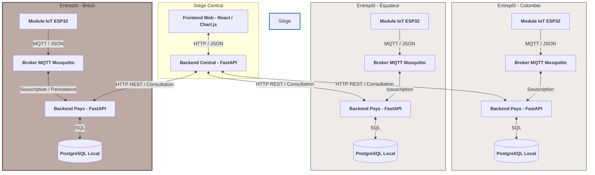
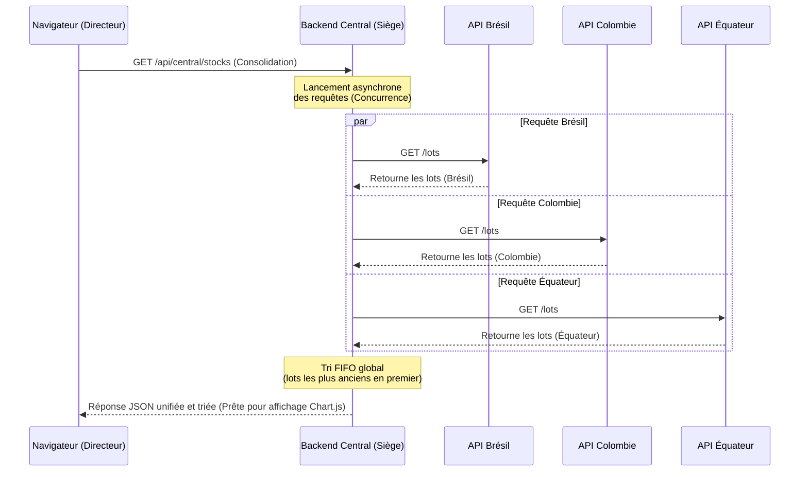

# Architecture & Référentiel Technique - FutureKawa IoT

Bienvenue dans le référentiel d'architecture et manuel technique de la solution globale de traçabilité et de supervision environnementale de **FutureKawa**. 

Ce document synthétise les choix d'architecture, la structure du code source, les dépendances clés, les prérequis d'installation et les procédures d'exécution (avec ou sans Docker).

---

## 1. Description du Projet

**FutureKawa IoT** est une plateforme logicielle distribuée conçue pour surveiller en temps réel les conditions environnementales (température et humidité) de stockage du café vert premium dans des entrepôts situés dans différents pays producteurs (Brésil, Colombie, Équateur) et consolider de manière centralisée ces données au siège de l'entreprise.

### Fonctionnalités principales :
*   **Télémétrie en temps réel** : Acquisition automatique des mesures ambiantes par capteurs connectés (ESP32) et transmission via protocole léger MQTT.
*   **Résilience locale (Edge Computing)** : Fonctionnement autonome de chaque entrepôt avec sa propre base de données locale (PostgreSQL), garantissant la traçabilité continue même en cas de coupure internet.
*   **Supervision consolidée au siège** : Portail web unifié agrégeant les données de stock et d'alertes des différents pays de manière asynchrone concurrente.
*   **Moteur de Vigilance** : Alertes automatiques instantanées par e-mail en cas de dérive climatique ou de dépassement de la durée légale de stockage (logique FIFO).

---

## 2. Structure du Projet

L'organisation des répertoires suit un découpage modulaire propre et découplé par domaine de responsabilité :

```
FutureKawa-iot/
├── backend-central/          # API d'agrégation centrale (Siège social)
│   ├── src/
│   │   ├── main.py           # Point d'entrée de l'API centrale FastAPI
│   │   ├── database.py       # Configuration SQL d'administration centrale
│   │   ├── models.py         # Modèles d'utilisateurs et rôles centraux
│   │   ├── auth.py           # Authentification centrale par jeton JWT
│   │   └── seed.py           # Script d'amorçage des données de test
│   ├── tests/                # Tests d'intégration de l'agrégation
│   └── requirements.txt      # Dépendances Python du backend central
│
├── backend-pays/             # API locale des entrepôts (Brésil, Équateur, Colombie)
│   ├── main.py               # Point d'entrée de l'API pays FastAPI & client MQTT
│   ├── models.py             # Modèle Logique des Données (MLD) SQL local
│   ├── database.py           # Configuration de la base PostgreSQL locale
│   ├── auth_middleware.py    # Validation décentralisée des jetons de sécurité
│   ├── tests/                # Tests Unitaires, Intégration et BDD (Gherkin)
│   ├── mosquitto.conf        # Configuration du broker de messagerie local
│   └── requirements.txt      # Dépendances Python du backend pays
│
├── frontend-web/             # Portail d'administration web de supervision
│   ├── src/
│   │   ├── app/App.jsx       # Routeur principal de l'interface
│   │   ├── components/       # Mise en page, cartes géographiques et modals
│   │   ├── pages/            # Écrans (Dashboard, Lots, Alertes, Stockage)
│   │   ├── services/         # Clients HTTP (lots, mesures, alertes, config)
│   │   └── styles/           # Icônes et styles visuels généraux
│   ├── package.json          # Métadonnées et dépendances Node.js (React)
│   └── webpack.config.js     # Configuration d'assemblage Webpack
│
├── futurekawa-simulateur/    # Simulateur de capteurs IoT locaux
│   └── simulateur.py         # Script Python publiant des trames JSON en MQTT
│
├── iot-module/               # Firmware embarqué destiné au microcontrôleur
│   ├── src/main.cpp          # Code C++ (PlatformIO) pour microcontrôleur ESP32
│   └── platformio.ini        # Configuration des cibles et des bibliothèques C++
│
└── Jenkins/                  # Pipelines d'intégration continue (CI/CD)
    └── Jenkinsfile_backend_pays # Script Jenkins de test et d'analyse SonarQube
```

---

## 3. Prérequis Système

Pour compiler, tester et exécuter le projet en local, assurez-vous de disposer des versions matérielles et logicielles minimales suivantes :

*   **Python** : Version `>= 3.10` (requise pour la syntaxe asynchrone moderne et le typage statique).
*   **Node.js** : Version `>= 18.0.0` avec gestionnaire de paquets `npm` associé.
*   **Docker & Docker Compose** : Recommandé pour orchestrer l'ensemble des conteneurs (Bases SQL, Brokers MQTT, APIs, Web).
*   **Broker MQTT** : Un broker compatible v3.1.1 (ex : Eclipse Mosquitto) si exécution hors-Docker.
*   **Base de données** : PostgreSQL ou SQLite (utilisé pour les tests rapides).

---

## 4. Installation & Déploiement

### Option A : Déploiement Containerisé avec Docker (Recommandé)

Docker permet d'isoler et de démarrer instantanément tous les services (Bases de données PostgreSQL locales/centrales, brokers MQTT, backends d'API FastAPI et interface web) en une seule commande.

####  Étape Préalable Obligatoire : Configuration de l'environnement
Étant donné que la configuration s'appuie sur des variables d'environnement sécurisées (mots de passe de base de données, clé secrète JWT), vous **devez** initialiser votre fichier `.env` local avant de lancer Docker Compose :
1.  **Copier le fichier d'exemple** :  
    À la racine du répertoire `FutureKawa-iot`, dupliquez le modèle :
    ```bash
    cp .env.example .env
    ```
2.  **Remplir les valeurs** :  
    Ouvrez le fichier `.env` et complétez les valeurs requises (notamment les mots de passe de base de données, la clé d'authentification `JWT_SECRET`, et les accès de l'administrateur d'origine).

####  Lancement des conteneurs
1.  **Exécuter l'orchestration globale** :  
    À la racine du projet `FutureKawa-iot`, exécutez la commande d'orchestration suivante :
    ```bash
    docker compose up -d --build
    ```
2.  **Accéder aux applications** :  
    *   **Portail de Supervision Web (React)** : Accessible à l'adresse **`http://localhost:3000`**
    *   **API Centrale (Siège)** : Accessible à l'adresse `http://localhost:9000/docs` (Documentation Swagger interactive)
    *   **API Locale (Pays - Brésil)** : Accessible à l'adresse `http://localhost:8000/docs`

####  Analyse technique du Build Frontend (Multi-stage)
Le conteneur du frontend (`frontend-web`) s'appuie sur un processus de construction en **double étape (Multi-stage Build)** optimisé pour la production :
*   **Étape 1 (Compilation / Node.js)** : Le conteneur se base sur une image légère `node:18-alpine`, copie les fichiers `package*.json`, exécute **`npm install`** pour installer toutes les dépendances d'interface, puis lance **`npm run build`** (compilation Webpack en mode production) pour générer l'ensemble des fichiers statiques minifiés dans le dossier `/app/dist`.
*   **Étape 2 (Service Web / Nginx)** : L'image de compilation est jetée au profit d'un serveur ultra-léger et performant, **Nginx**. Il copie uniquement les fichiers statiques générés à l'étape 1 (`/app/dist`) directement dans son dossier public de diffusion (`/usr/share/nginx/html`). 
*   Ce processus élimine l'empreinte de Node.js en production, réduit la taille de l'image de 90% et améliore considérablement les performances de chargement pour l'utilisateur final.

---

### Option B : Exécution Manuelle Locale (Sans Docker)

Pour exécuter le projet en environnement de développement classique sous Windows/macOS/Linux :

#### 1. Configuration et lancement du Backend Pays (Entrepôt local)
1.  Naviguez dans le dossier concerné :
    ```bash
    cd FutureKawa-iot/backend-pays
    ```
2.  Créez et activez un environnement virtuel Python :
    ```bash
    python -m venv venv
    # Sous Windows (Powershell) :
    .\venv\Scripts\Activate.ps1
    # Sous macOS/Linux :
    source venv/bin/activate
    ```
3.  Installez les dépendances requises :
    ```bash
    pip install -r requirements.txt
    ```
4.  Configurez les variables d'environnement dans un fichier `.env` (inspiré de `.env.example`) :
    ```ini
    PAYS=bresil
    DATABASE_URL=sqlite:///./futurekawa_local.db
    MQTT_BROKER=localhost
    MQTT_PORT=1883
    ```
5.  Lancez le serveur d'API FastAPI :
    ```bash
    uvicorn main:app --reload --port 8010
    ```

#### 2. Configuration et lancement du Frontend Web (React)
1.  Naviguez dans le dossier du frontend :
    ```bash
    cd ../frontend-web
    ```
2.  Installez les dépendances Node.js :
    ```bash
    npm install
    ```
3.  Démarrez le serveur d'assemblage et d'affichage en mode développement :
    ```bash
    npm start
    ```
    L'interface de supervision s'ouvre alors à l'adresse `http://localhost:8080`.

---

## 5. Dépendances Clés du Projet

La solution s'appuie sur des bibliothèques de référence garantissant la pérennité et la conformité industrielle du projet :

### Backends (Python - FastAPI / SQLAlchemy) :
*   **FastAPI** : Framework web asynchrone utilisé pour concevoir et servir les APIs HTTP REST locales et centrales de manière ultra-rapide.
*   **Uvicorn** : Serveur d'interface réseau asynchrone (ASGI) de production pour héberger les APIs Python.
*   **SQLAlchemy** : Boîte à outils SQL et ORM (Object-Relational Mapping) traduisant nos classes Python en tables relationnelles PostgreSQL locales.
*   **Paho-MQTT** : Client léger de protocole MQTT permettant au backend pays de souscrire aux topics de télémétrie et de consommer les messages des capteurs ESP32.
*   **Psycopg2-binary** : Pilote (driver) PostgreSQL permettant à SQLAlchemy de communiquer de manière sécurisée avec le serveur de base de données.
*   **Pytest & Pytest-BDD** : Moteurs de tests automatisés servant à valider le comportement fonctionnel de l'application en langage naturel (Gherkin).

### Frontend (JavaScript / React - Webpack) :
*   **React** : Bibliothèque de composants UI servant à concevoir une interface utilisateur dynamique, modulaire et hautement interactive.
*   **Ant Design (antd)** : Framework de composants d'interface de classe entreprise servant à harmoniser l'esthétique générale de l'application (tableaux, modals, formulaires).
*   **Recharts** : Bibliothèque graphique optimisée sous React servant à dessiner les courbes historiques des conditions ambiantes (température et humidité) par lot.

---

## 6. Vue d'Ensemble & Topologie Distribuée

Afin de refléter fidèlement l'organisation internationale de FutureKawa (Brésil, Colombie, Équateur, et le siège central), la solution s'appuie sur une **architecture distribuée et décentralisée**.



---

## 7. Choix Technologiques & Justifications

Chaque composant a été sélectionné pour répondre aux contraintes du monde réel (Réseau fluctuant en entrepôt, besoin de robustesse, facilité de maintenance).

### A. FastAPI (Python) - *Backends Pays & Central*
*   **Justification :** FastAPI est un framework web moderne et ultra-performant. 
*   **Critère d'Efficacité :** Basé sur Starlette et Pydantic, il supporte nativement l'asynchronisme (`async/await`), ce qui permet au Backend Central d'interroger les 3 API pays de manière asynchrone et concurrente sans bloquer le thread principal.
*   **Critère de Pérennité :** Génère automatiquement la documentation interactive des API aux normes standards **OpenAPI (Swagger)**, facilitant grandement l'intégration pour les futures équipes de développement.

### B. MQTT via Eclipse Mosquitto - *Messagerie IoT*
*   **Justification :** MQTT est le protocole de messagerie standard pour l'Internet des Objets (IoT).
*   **Critère de Stabilité :** Conçu pour des connexions à bande passante limitée ou instable (cas typique des entrepôts isolés en Amérique du Sud), il consomme très peu d'énergie et de ressources par rapport à du HTTP.
*   **Découpage Temporel :** L'ESP32 publie ses mesures et se déconnecte immédiatement. Le broker stocke le message si l'API locale est momentanément indisponible, garantissant qu'aucune donnée de température critique ne soit perdue.

### C. PostgreSQL - *Persistance Locale*
*   **Justification :** Système de gestion de base de données relationnelle open-source robuste.
*   **Sécurité et Intégrité :** Garantit la conformité ACID complète pour sécuriser l'historique de traçabilité des lots (exigence réglementaire stricte de traçabilité et d'auditabilité pour les clients B2B de FutureKawa).

### D. Docker & Docker Compose - *Conteneurisation*
*   **Justification :** L'ensemble de la solution est conteneurisé.
*   **Portabilité :** Permet un déploiement standardisé et reproductible à l'identique dans chaque pays et au siège, tout en éliminant le problème classique du *"ça marche sur ma machine"*.

---

## 8. Analyse de Robustesse : Stabilité, Efficacité, Pérennité

###  Stabilité (Résilience & Autonomie Locale)
La pire erreur architecturale pour FutureKawa aurait été de concevoir une base de données unique au siège avec des appels distants constants depuis les pays : une coupure d'Internet au Brésil bloquerait instantanément l'enregistrement des températures et l'envoi d'alertes locales.

*   **Autarcie Locale :** Chaque pays possède son propre broker MQTT, sa base PostgreSQL locale et son API FastAPI autonome. Si le siège central est en panne ou inaccessible, **l'entrepôt local continue de fonctionner normalement** : les relevés IoT sont enregistrés, et les alertes par email sont émises localement.
*   **Isolation des pannes :** Une panne dans l'entrepôt en Équateur n'affecte en rien les opérations en Colombie ou au Brésil.

###  Efficacité (Performances Applicatives)
*   **Agrégation Concurrente :** Le backend central n'interroge pas les API pays de manière séquentielle (l'une après l'autre). Il utilise des appels HTTP non-bloquants lancés en parallèle via `asyncio.gather`. Le temps de réponse total équivaut au temps de réponse du pays le plus lent, plutôt qu'à la somme des trois.
*   **Légèreté de l'IoT :** L'envoi de données structurées en JSON léger par MQTT limite la charge réseau locale des microcontrôleurs ESP32.

###  Pérennité (Évolutivité du système)
*   **Extensibilité sans recodage (Design Patterns d'Infrastructures) :** Le backend central charge la liste des pays de manière dynamique. Pour ajouter un 4ème pays (ex: Costa Rica), il suffit d'ajouter sa variable d'environnement (`COUNTRY_COSTARICA_URL`) au déploiement central.
*   **Découplage total :** Le frontend web ne discute jamais directement avec les pays. Il communique uniquement avec le backend central. Cela permet de modifier l'architecture interne ou de migrer un pays d'un serveur à un autre sans jamais impacter ou réécrire l'interface utilisateur.

---

## 9. Flux de Données Nominaux (Séquences)

### A. Télémétrie et Alerte IoT (Temps Réel Local)
Ce flux montre comment une température hors-limite est captée, enregistrée et comment l'alerte est immédiatement dispatchée localement par email.

```mermaid
sequenceDiagram
    participant ESP32 as Module IoT (ESP32)
    participant Broker as Broker Mosquitto Local
    participant API as API Pays Local (FastAPI)
    participant BDD as PostgreSQL Local
    participant SMTP as Serveur SMTP (Email)

    ESP32->>Broker: Publie mesure (JSON: temp, hum) sur "capteur/mesures"
    Note over ESP32, Broker: Protocole MQTT
    Broker-->>API: Transmet le message (Souscription active)
    
    rect rgb(80, 80, 80)
        Note over API: Analyse de la mesure<br/>par rapport aux seuils du pays
        alt Température ou Humidité hors-limites
            API->>BDD: Crée une Alerte en BDD (statut: non-lue)
            API->>SMTP: Envoi d'un Email d'Alerte automatique au responsable d'entrepôt
        end
    end

    API->>BDD: Persiste la mesure en BDD (historique traçabilité)
```



### B. Consolidation et Supervision (Siège Central)
Ce flux montre l'asynchronisme utilisé par le siège pour consolider l'état global des stocks en temps réel pour le Directeur des Opérations.

