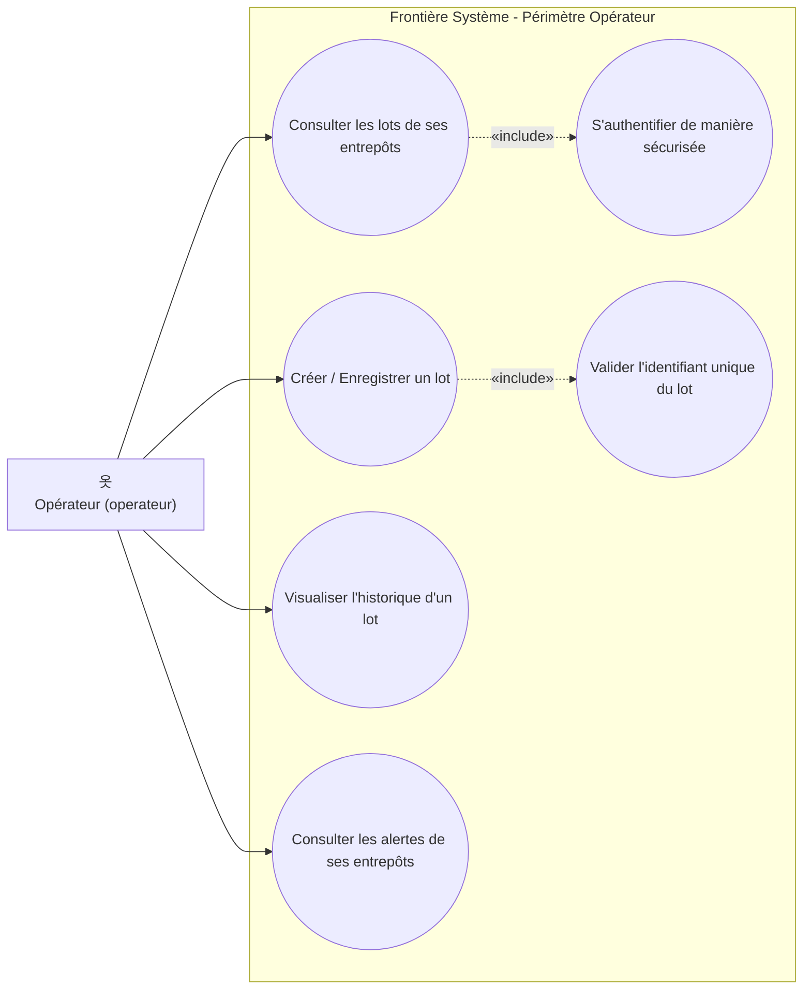
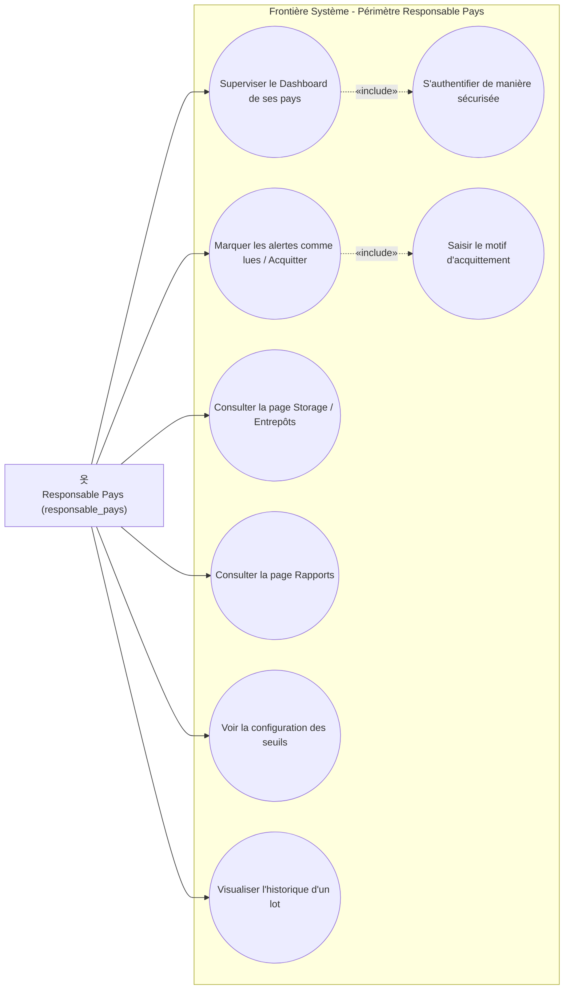
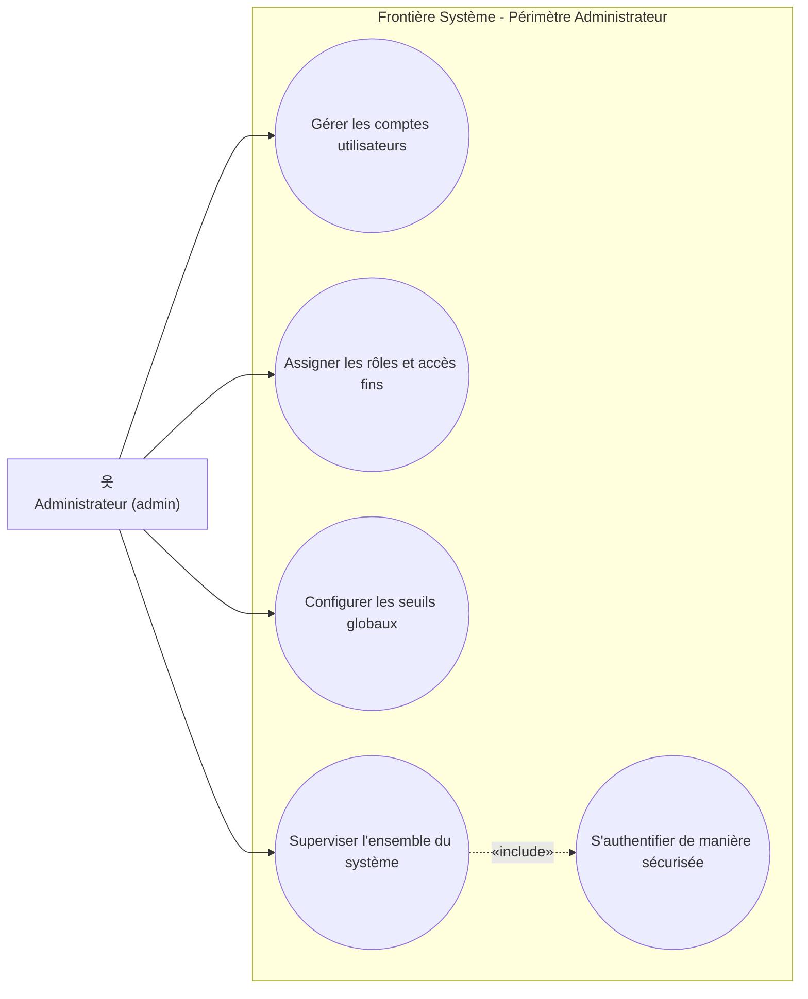
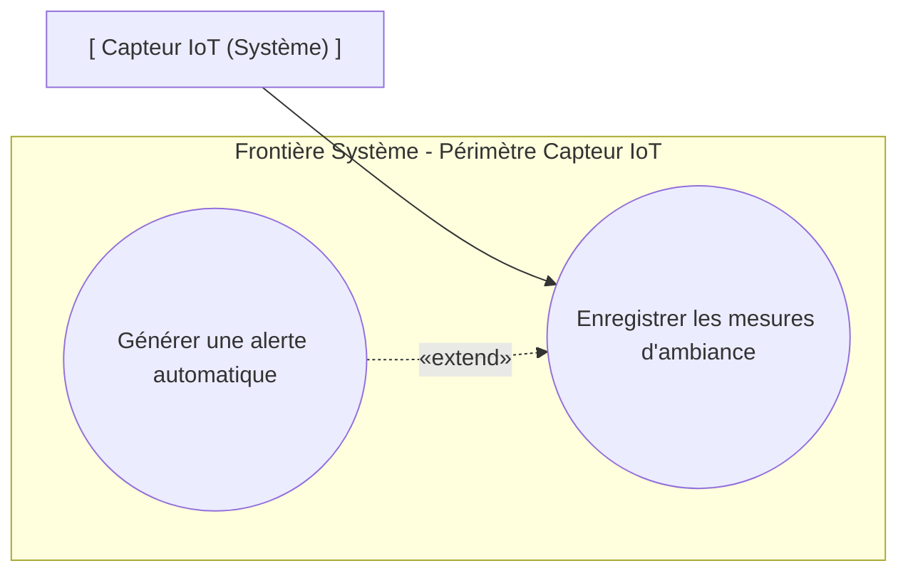
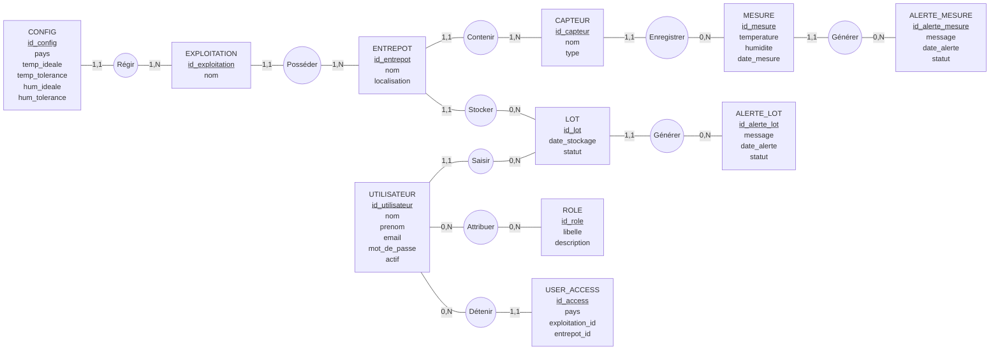
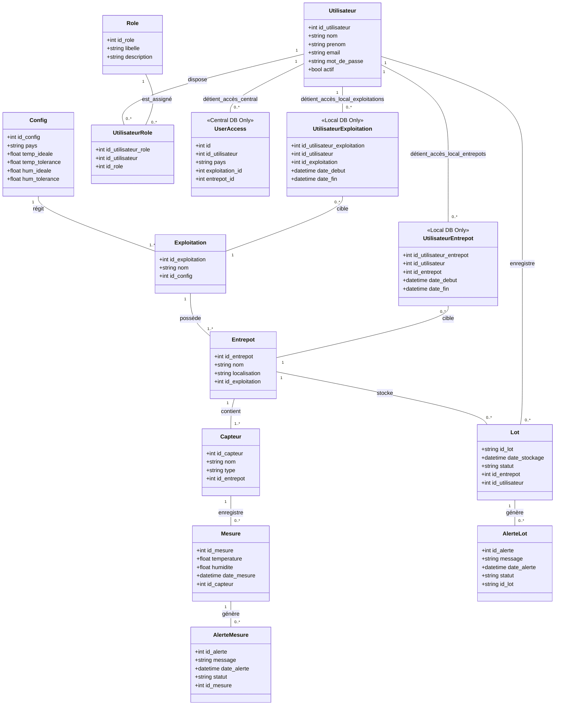
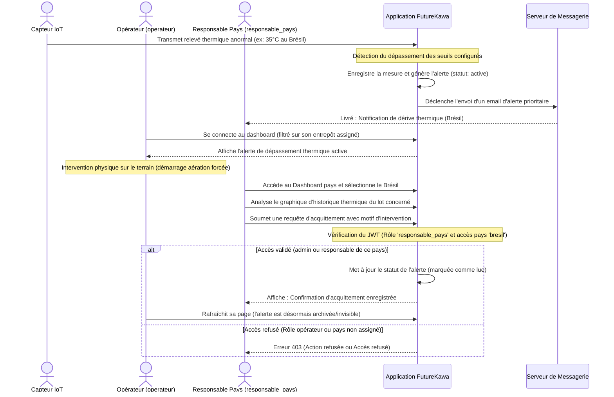

# Conception UML, MCD & Cas d'Utilisation - FutureKawa IoT

Ce document présente la phase de conception fonctionnelle et technique du système FutureKawa IoT à travers la modélisation UML (Unified Modeling Language) et Merise (MCD). Il a été mis à jour pour s'aligner rigoureusement sur le modèle de contrôle d'accès basé sur les rôles (RBAC) décrit dans la spécification d'accès du projet.

---

## 1. Diagrammes de Cas d'Utilisation par Acteur (Use Cases)

Afin d'éviter la surcharge d'un diagramme unique et les croisements complexes de flèches, la conception des cas d'utilisation a été segmentée par acteur du système. Cette approche permet de visualiser de manière ciblée le périmètre d'action, les inclusions («include») et extensions («extend») pour chaque rôle applicatif.

---

### A. Rôle : Opérateur (`operateur`)

L'opérateur intervient sur le terrain pour gérer l'entrée physique des lots et suivre localement l'état des entrepôts qui lui sont personnellement assignés.

**Description des actions :**
* **Créer / Enregistrer un lot** : Déclare l'entrée en stock d'un nouveau lot de café vert dans un hangar de l'un de ses entrepôts assignés. *Cette action inclut de force la validation syntaxique de l'identifiant unique.*
* **Consulter ses lots & alertes** : Suit l'état des stocks et visualise les dérives climatiques actives pour ses seuls entrepôts de rattachement. *La consultation nécessite une authentification préalable par JWT.*
* **Visualiser l'historique** : Analyse les courbes d'humidité et de température d'un lot sous sa responsabilité.

---

### B. Rôle : Responsable Pays (`responsable_pays`)

Le responsable pays pilote la conformité qualité et supervise l'ensemble des installations, des lots et des alertes pour les pays d'Amérique du Sud qui lui sont assignés.

**Description des actions :**
* **Superviser le Dashboard national** : Suit en temps réel les indicateurs clés et l'état des entrepôts de ses pays.
* **Marquer les alertes comme lues / Acquitter** : Valide l'acquittement d'une alerte climatique ou d'ancienneté. *L'acquittement implique obligatoirement l'écriture d'un motif explicatif (recherche de cause, action corrective).*
* **Consulter Storage, Rapports et Config** : Accède à l'inventaire des capteurs, télécharge les rapports de traçabilité mensuels et examine les seuils de tolérance thermo-hydriques de ses pays.

---

### C. Rôle : Administrateur (`admin`)

L'administrateur possède un accès global et illimité. Il est le seul rôle habilité à administrer la sécurité, configurer les paramètres généraux et gérer les utilisateurs du système.

**Description des actions :**
* **Gérer les comptes utilisateurs** : Crée, active, désactive ou modifie les fiches des employés en base centrale.
* **Assigner les rôles et accès fins** : Lie un rôle (`admin`, `responsable_pays`, `operateur`) à un compte et lui associe de manière extrêmement fine des accès géographiques par pays, par exploitation ou par entrepôt (table `user_access`).
* **Configurer les seuils globaux** : Modifie les seuils d'alerte climatiques, d'ancienneté des stocks de café, et configure les destinataires de notification mail pour l'ensemble des pays d'opération.
* **Superviser l'ensemble du système** : Bénéficie par héritage de tous les droits de consultation et d'acquittement, sans restriction géographique.

---

### D. Acteur : Capteur IoT (Système)

Le capteur IoT est un acteur automatique technologique qui alimente la base de données et lève de manière autonome des alertes climatiques.

**Description des actions :**
* **Enregistrer les mesures d'ambiance** : Transmet périodiquement les valeurs de température et d'humidité mesurées par les sondes physiques.
* **Générer une alerte automatique** : Si la température ou l'humidité mesurées sortent de la plage de tolérance de la configuration, le cas d'utilisation d'enregistrement est étendu par la génération et l'enregistrement automatique d'une alerte en base de données.

---

## 2. Modèle Conceptuel de Données (MCD - Merise)

Le Modèle Conceptuel de Données (MCD) décrit la structure d'information de manière abstraite. Les entités liées aux rôles et à l'accès (`UTILISATEUR`, `ROLE` et `USER_ACCESS`) ont été rigoureusement réadaptées pour correspondre à l'architecture RBAC réelle du système.

### Règles d'Associations et Cardinalités (Merise) :

*   **Régir** : Une configuration réglementaire (`CONFIG`) régit une ou plusieurs exploitations d'un pays. Cardinalités : `CONFIG (1,1)` - `EXPLOITATION (1,N)`.
*   **Posséder** : Une exploitation possède un ou plusieurs entrepôts physiques de stockage. Cardinalités : `EXPLOITATION (1,1)` - `ENTREPOT (1,N)`.
*   **Contenir** : Un entrepôt contient un ou plusieurs capteurs IoT physiques. Cardinalités : `ENTREPOT (1,1)` - `CAPTEUR (1,N)`.
*   **Stocker** : Un entrepôt héberge zéro ou plusieurs lots de café vert. Cardinalités : `ENTREPOT (1,1)` - `LOT (0,N)`.
*   **Enregistrer** : Un capteur de télémétrie enregistre zéro ou plusieurs mesures d'ambiance au fil du temps. Cardinalités : `CAPTEUR (1,1)` - `MESURE (0,N)`.
*   **Saisir** : Un utilisateur authentifié (généralement opérateur de terrain) saisit l'entrée en stock de zéro ou plusieurs lots de café. Cardinalités : `UTILISATEUR (1,1)` - `LOT (0,N)`.
*   **Attribuer (Liaison Associative)** : Un utilisateur possède un ou plusieurs rôles d'accès (`admin`, `responsable_pays`, `operateur`), et un rôle peut être attribué à zéro ou plusieurs utilisateurs (many-to-many). Cardinalités : `UTILISATEUR (0,N)` - `ROLE (0,N)`.
*   **Détenir (Accès fins)** : Un utilisateur possède zéro ou plusieurs autorisations d'accès géographiques (`USER_ACCESS`), chaque autorisation ciblant de manière optionnelle un pays, une exploitation et/ou un entrepôt spécifique. Cardinalités : `UTILISATEUR (0,N)` - `USER_ACCESS (1,1)`.
*   **Générer (Mesure)** : Une mesure hors-limite génère zéro ou plusieurs alertes de conditions de stockage. Cardinalités : `MESURE (1,1)` - `ALERTE_MESURE (0,N)`.
*   **Générer (Lot)** : Un lot stocké depuis plus de 365 jours génère zéro ou plusieurs alertes de péremption. Cardinalités : `LOT (1,1)` - `ALERTE_LOT (0,N)`.

---

## 3. Diagramme de Classes (Structure Logique - UML)

Le diagramme de classes ci-dessous modélise la structure physique et logique de nos bases de données. Il intègre désormais la table `UserAccess` utilisée au niveau de la base centrale pour restreindre géographiquement les rôles, ainsi que les tables locales de propagation d'accès (`UtilisateurExploitation`, `UtilisateurEntrepot`) au sein de la base de données de chaque pays.

---

## 4. Diagramme de Séquence Fonctionnel (Scénario d'Alerte & Contrôle RBAC)

Ce diagramme décrit la séquence des échanges fonctionnels lors d'un scénario de détection de dérive thermique au sein d'un entrepôt. Il met en scène le rôle restrictif de l'**Opérateur** (qui constate l'alerte sur son secteur et résout l'incident de façon physique mais n'a pas les droits pour l'acquitter en ligne) et le rôle du **Responsable Pays** (qui analyse l'historique et possède l'autorisation de marquer l'alerte comme lue en base de données).

