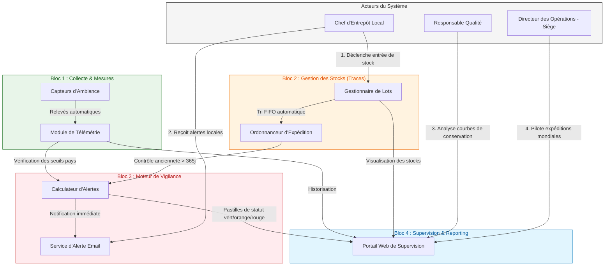

# Guide Utilisateur & Référentiel Fonctionnel - FutureKawa IoT

Bienvenue dans le guide utilisateur de la solution de suivi et de surveillance environnementale **FutureKawa IoT**. 

Ce document a pour but de vous accompagner dans la prise en main de l'application et de détailler les fonctionnalités mises à votre disposition selon votre profil métier.

---

## 1. Architecture Fonctionnelle du Système

Contrairement à l'architecture technique, l'architecture fonctionnelle décrit **ce que fait le système** pour répondre à vos besoins métiers, sans se soucier de la technologie sous-jacente.

---

## 2. Fonctionnalités de l'Application

L'application **FutureKawa IoT** s'articule autour de quatre grandes fonctionnalités indispensables au pilotage de notre chaîne d'approvisionnement et de conservation :

### A. Saisie et Traçabilité des Lots
*   **Saisie rapide** : Enregistrement d'un nouveau lot de café dès son entrée à l'entrepôt, avec identifiant unique, choix de l'exploitation locale et date de stockage.
*   **Statut en temps réel** : Suivi permanent de la conformité de chaque lot (Conforme, En alerte, Périmé) visible immédiatement sur l'interface.

### B. Télémétrie et Suivi Environnemental (IoT)
*   **Relevés automatisés** : Remontée automatique et en temps réel des courbes de température et d'humidité intérieure des hangars grâce aux capteurs connectés.
*   **Suivi historique** : Visualisation graphique de l'historique complet d'un lot, agrémentée d'une ligne de référence indiquant les conditions de stockage idéales spécifiques au pays.

### C. Moteur de Vigilance & Alertes Automatiques
*   **Détection des dérives** : Envoi immédiat d'une notification prioritaire par e-mail en cas d'écarts de température/humidité ou lorsqu'un lot de café dépasse sa durée légale de stockage (365 jours).
*   **Console d'alertes** : Tableau de bord répertoriant les alertes actives avec possibilité de les acquitter (marquer comme lues) après résolution physique du problème.

### D. Console de Supervision Centrale (Multi-pays)
*   **Vue consolidée au siège** : Agrégation asynchrone ultra-rapide des stocks et indicateurs des trois pays d'exploitation (Brésil, Équateur, Colombie) sur une seule et même interface.
*   **Ordre d'expédition FIFO** : Tri automatique des stocks du plus ancien au plus récent, permettant aux décideurs du siège de planifier les chargements de conteneurs en priorité absolue.

---

## 3. Profils Utilisateurs & Cas d'Usage Métiers

L'application s'adapte à votre quotidien à travers trois profils d'accès spécifiques :

### A. Le Chef d'Entrepôt Local (Opérations Terrain)
*   **Votre rôle :** Garantir la bonne réception des lots et réagir en cas d'anomalie environnementale dans vos hangars.
*   **Vos fonctionnalités clés :**
    1.  **Enregistrement d'un lot :** Saisie rapide de l'ID du lot lors de son entrée physique dans l'entrepôt.
    2.  **Réception des alertes :** Vous recevez un e-mail automatique dès qu'un capteur détecte une température ou une humidité hors-norme, ou qu'un lot dépasse 365 jours de stockage.

### B. Le Responsable Qualité (Traçabilité & Conformité)
*   **Votre rôle :** Auditer les conditions de conservation historiques pour garantir aux clients B2B la qualité premium du café vert.
*   **Vos fonctionnalités clés :**
    1.  **Suivi des courbes d'ambiance :** En cliquant sur un lot, vous visualisez le graphique thermique et hydrométrique complet depuis sa date d'entrée.
    2.  **Lignes de référence de qualité :** L'écran affiche une ligne pointillée représentant la cible idéale du pays (ex: 29°C pour le Brésil) afin de détecter visuellement les micro-dérives.

### C. Le Directeur des Opérations (Siège Global)
*   **Votre rôle :** Piloter la Supply Chain globale et arbitrer les priorités de vente et de transport.
*   **Vos fonctionnalités clés :**
    1.  **Console de Supervision consolidée :** Vue unifiée des stocks de l'ensemble des pays (Brésil, Équateur, Colombie).
    2.  **Gestion de la rotation (Priorité FIFO) :** L'interface affiche automatiquement les lots triés du plus ancien au plus récent. Vous savez en un coup d'œil quel lot doit être chargé en priorité dans les conteneurs d'expédition.

---

## 4. Guide Pratique : Que faire en cas d'Alerte ?

Le système de vigilance classe les alertes en deux catégories visuelles claires :

| Couleur de l'Alerte | Signification Métier | Action Requise |
| :---: | :--- | :--- |
| 🟠 **Orange (Alerte conditions)** | Dérive de température ou d'humidité dans un entrepôt. | 1. Consulter le graphique du lot pour évaluer la durée de la dérive. 2. Inspecter physiquement les équipements d'aération/chauffage locaux. |
| 🔴 **Rouge (Lot Périmé)** | Le lot est stocké depuis plus de 365 jours. Risque de perte d'arômes. | 1. Isoler physiquement le lot concerné. 2. Planifier un contrôle qualité sensoriel (cupping) pour décider d'un déclassement ou d'une torréfaction immédiate. |
