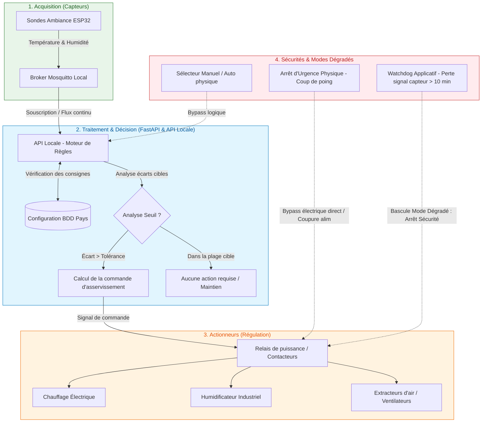

# Référentiel de Cadrage & Prototype d'Automatisation - Phase 2

> **Document de préparation à l'évolutivité industrielle (Phase 2)**  
> **Auteurs :** Équipe Projet FutureKawa IoT  
> **Livrables associés :** Schéma de principe d'automatisation (Section 9) & Questionnaire d'interview (Section 10).

---

## 1. Prototype de Schéma de Fonctionnement d'Automatisation

Ce schéma modélise la logique d'asservissement des équipements d'entrepôt (chauffage, humidification, ventilation) pilotés par les relevés des capteurs IoT de la Phase 1, en intégrant les cas nominaux, les cas dégradés, et les sécurités physiques.

### Description de la logique de fonctionnement :

#### A. Cas Nominal (Régulation Automatique)
*   Les sondes ESP32 publient en continu (MQTT) les mesures au moteur de règles FastAPI.
*   L'API calcule la dérive par rapport aux valeurs cibles du pays (ex : Brésil 29°C / 55% H).
*   Si la mesure dépasse les tolérances ($\pm 3^\circ\text{C}$ de température, $\pm 2\%$ d'humidité), FastAPI envoie un signal de commande aux relais industriels pour activer l'actionneur approprié (chauffage, humidification ou ventilation).

#### B. Cas Dégradé & Sécurités logicielles (Watchdog)
*   **Perte de signal (Watchdog) :** Si un capteur n'émet plus de données pendant plus de 10 minutes, le système passe en **mode dégradé**. Par sécurité, l'alimentation des chauffages et humidificateurs est coupée d'office pour éviter tout emballement thermique en cas de sonde défaillante.
*   **Alerte système :** Une notification prioritaire de défaut de communication est immédiatement envoyée par e-mail au responsable.

#### C. Sécurités physiques (Bypass de secours)
*   **Arrêt d'Urgence matériel (Coup de poing) :** Un bouton physique coupe directement la puissance électrique des contacteurs d'actionneurs, de manière 100 % indépendante du réseau et de l'informatique.
*   **Commutateur Manuel / Auto :** Permet de désactiver le moteur logique pour piloter manuellement chaque ventilateur ou chauffage lors des opérations de maintenance.

---

## 2. Questionnaire pour l'Interview de Cadrage "Phase 2"

> **Objectif :** Préparer la transition industrielle vers l'automatisation en récoltant des réponses précises de la part des directions métiers.

---

###  AXE 1 : Objectifs Métiers de l'Automatisation
*   **Q 2.1.1 : Amélioration de la qualité produit**  
    En régulant automatiquement les conditions de conservation au lieu de simples alertes passives, quel gain qualitatif sur le café vert ciblez-vous (ex: réduction du taux de perte de lots de x %, diminution de l'humidité résiduelle moyenne) ?
*   **Q 2.1.2 : Objectifs environnementaux & énergétiques**  
    Avez-vous des contraintes de consommation énergétique pour ces entrepôts ? L'automatisation doit-elle intégrer un algorithme d'économie d'énergie (ex: privilégier l'aération naturelle par extracteurs plutôt que le chauffage énergivore si les conditions extérieures le permettent) ?

---

###  AXE 2 : Contraintes Industrielles (Sécurité, Maintenance, Coûts, Responsabilités)
*   **Q 2.2.1 : Responsabilité juridique et humaine**  
    En cas de dysfonctionnement de l'automatisme ayant entraîné la détérioration d'un lot, où se situe la limite de responsabilité logicielle par rapport à la surveillance humaine ? Est-il obligatoire de conserver un registre inaltérable (audit log) de chaque commande envoyée par l'automate ?
*   **Q 2.2.2 : Coûts opérationnels & investissement**  
    Quel budget maximum par entrepôt est alloué à l'installation des relais de puissance, des câblages et des actionneurs physiques ?
*   **Q 2.2.3 : Compétences de maintenance de niveau 2**  
    Vos équipes logistiques locales disposent-elles des compétences électriques de base pour remplacer un relais défectueux, ou l'intégralité de la maintenance des automates doit-elle faire l'objet d'un contrat de support externe ?

---

###  AXE 3 : Tolérances & Modes de Fonctionnement (Manuel/Auto)
*   **Q 2.3.1 : Sensibilité et inertie des bâtiments**  
    Pour éviter des cycles d'allumage/extinction trop fréquents des équipements (phénomène de pompage qui use prématurément le matériel), quelle inertie temporelle ou écart de tolérance minimal (hystérésis) souhaitez-vous appliquer aux seuils de régulation (ex : ne déclencher le chauffage qu'après 5 minutes consécutives sous le seuil) ?
*   **Q 2.3.2 : Modes d'urgence prioritaires**  
    Souhaitez-vous que le mode d'urgence "Bypass manuel physique" soit signalé de manière sonore ou visuelle dans l'entrepôt pour indiquer que le système n'est plus sous contrôle automatique ?

---

###  AXE 4 : Priorités de Déploiement & Indicateurs de Réussite
*   **Q 2.4.1 : Stratégie de déploiement progressif**  
    Souhaitez-vous tester l'automatisation d'abord sur un seul type d'équipement (ex: n'automatiser que l'aération/ventilation dans un premier temps), ou déployer le triptyque complet (chauffage, humidité, ventilation) dès le site pilote ?
*   **Q 2.4.2 : Indicateurs de réussite du projet (KPI Phase 2)**  
    Quels indicateurs valideront le succès de cette Phase 2 à la fin de la période d'évaluation pilote (ex: réduction du nombre d'e-mails d'alerte de 90 %, maintien des conditions cibles 99% du temps) ?

---

###  AXE 5 : Risques Opérationnels & Scénarios d'Incidents
*   **Q 2.5.1 : Scénario d'incendie ou court-circuit**  
    Le système d'automatisation doit-il être asservi à la centrale d'alarme incendie de l'entrepôt (ex: coupure électrique immédiate et ouverture forcée des extracteurs d'air en cas de détection de fumée) ?
*   **Q 2.5.2 : Incident d'actionneur bloqué**  
    Si le système commande l'arrêt du chauffage mais que la température continue de grimper (relais resté collé / panne mécanique), comment l'application doit-elle réagir pour protéger le stock (ex: coupure de l'alimentation générale par disjoncteur auxiliaire, sirène locale d'urgence) ?
